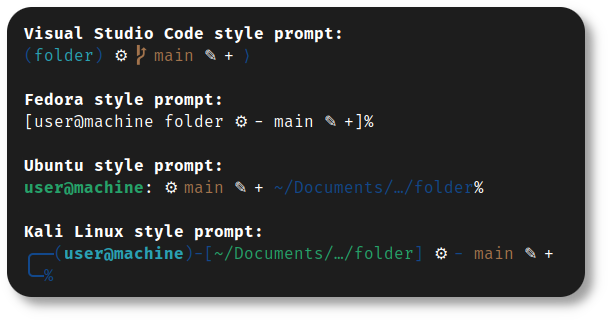

<h1 align="center">
	
	<br>Configuration de Pop!_OS<br>
</h1>
<p align="center">
	<a href="https://github.com/nico-castell/PopOS-Setup/commits"></a>
	<a href="https://github.com/nico-castell/PopOS-Setup/releases"></a>
	<a href="LICENSE"></a>
	<a href="https://github.com/nico-castell/PopOS-Setup"></a>
</p>

<h2 align="center">Comment l'utiliser</h2>

Je suppose que vous venez d'installer [Pop!_OS](https://pop.system76.com/) avec succès.

1. Clonez ce dépôt, vous pouvez faire un clone superficiel si vous le souhaitez (en ajoutant `--depth=1` à la ligne
de commande).
	```shell
	$ git clone https://github.com/AntoineMeheut/PopOS-Setup.git
	```
2. Étant donné que la branche principale est toujours en développement, vous voudrez peut-être vérifier le dernier tag,
qui sera la dernière version stable connue.
	```shell
	$ git checkout $(git describe --tags --abrev=0) # Aller à la dernière branche
	$ git checkout main                             # Retour à la principale branche
	```
3. (Facultatif) Consultez les instructions dans le script thme [gnome_apperance](scripts/gnome_appearance.sh),
	et configurez la structure de fichiers du script pour configurer l'apparence de GNOME avec vos thèmes.
	```
	scripts
	└── themes
	    ├── background
	    │   └── image.png
	    ├── cursor
	    │   └── cursor.tar.gz
	    ├── icons
	    │   └── icons.tar.gz
	    └── theme
	        └── theme.tar.gz
	```
4. (Facultatif) Si vous envisagez de créer un serveur minecraft, vous devez vérifier les variables `$download_link` 
	et `$version`, il y a un flag `TODO` pour être facile à trouver.
5. Exécuter le script [popOS_setup.sh](popOS_setup.sh).
	```shell
	$ ./popOS_setup.sh
	```
6. Suivez alors les instructions du script.
7. Ce script vous demandera d'autres instructions au fur et à mesure qu'il fera son travail.

<h2 align="center">Gardez à l'esprit</h2>

- Vous **devez** disposer d'une connexion Internet pour exécuter le script.
- Si vous choisissez de mettre à jour l'image de sauvegarde, vous devrez télécharger une image entière de
    [Pop!_OS](https://pop.system76.com/). Cela peut donc prendre du temps, en fonction de votre connexion
Internet.
- Si vous utilisez un ancien GPU nvidia non pris en charge par le dernier pilote nvidia, il pourrait être préférable
    de télécharger l'ISO [Pop!_OS](https://pop.system76.com/) sans leur pilote personnalisé, puis
    de choisir le dernier pilote prenant en charge votre GPU dans la liste proposée par le script.

<h2 align="center">Fonctionnalités</h2>

Ce projet peut mettre en place des fonctionnalités puissantes, telles que :

- Invites avancées et stylisées pour **Z-Shell** :
	<p align="center"></p>
- "Powerline plugin" pour l'éditeur **Vim** :
	<p align="center"></p>
- Vous trouverez plusieurs listes facilement extensibles de packages avec lesquels le script peut fonctionner : [packages.txt](packages.txt),
	[flatpaks.txt](flatpaks.txt) and [remove.txt](remove.txt)
- Prise en compte de scripts shell supplémentaires que vous pouvez ajouter à votre convenance.
- Un [script](scripts/mc_server_builder.sh) pour configurer un serveur minecraft.
- Un [script](back_me_up.sh) pour sauvegarder votre répertoire personnel.
- Un [script](scripts/update_recovery.sh) pour mettre à jour votre partition de récupération.

<h2 align="center">Problèmes connus</h2>

1. Le lien pour télécharger la dernière version du serveur
doit être mis à jour manuellement la version de minecraft que vous souhaitez installer.

<h2 align="center">Licence</h2>

Ce référentiel, et toutes les contributions à ce référentiel, sont sous la [LICENCE MIT](LICENSE).
Ce logiciel peut également installer des packages sous différentes licences, la licence de ce projet ne
s'appliquer à eux, voir chaque paquet.


> *Lorsque vous dites «le droit à la vie privée ne me préoccupe pas, parce que je n'ai rien à cacher», cela ne fait aucune différence avec le fait de dire «Je me moque du droit à la liberté d'expression parce que je n'ai rien à dire», ou «de la liberté de la presse parce que je n'ai rien à écrire»*.  
> *Edward Snowden*
